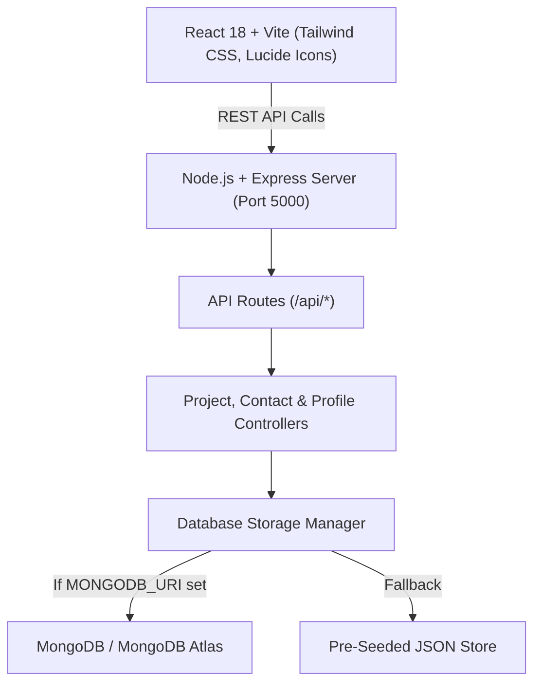

# Shaik Moukhil - Full-Stack Developer Portfolio

A responsive, high-performance personal portfolio website built with a **React + Vite + Tailwind CSS** frontend, a **Node.js & Express.js** REST API backend, and **MongoDB** database support (with an automatic zero-configuration fallback).

Designed specifically to showcase **Shaik Moukhil's** credentials, technical skillset across Java, Spring Boot, React, Node.js, and databases, hackathon-winning achievements, and full-stack projects.

---

## 🌟 Key Features

1. **High-Impact Hero Section**:
   - High-resolution developer portrait with glowing halo and animated status indicator.
   - Dynamic typing animation highlighting key roles (*Java Full Stack Developer*, *Spring Boot Specialist*, *React & Node.js Engineer*).
   - Fast action buttons: *View Projects*, *Contact Me*, and *Quick Resume Inquiry*.

2. **Milestones & Credentials**:
   - Academic distinction: **B.Tech Computer Science & Data Science** at **Lords Institute of Engineering & Technology** (**8.14 CGPA**).
   - **Hackathon Winner (1st Place)** for the E-Printing Application (Sep 2025).
   - **Machine Learning Intern** at MANAC Infotech Private Limited.

3. **Interactive Categorized Skills Matrix**:
   - Filter tabs: *Programming Languages*, *Backend Technologies*, *Frontend Technologies*, *Databases & Storage*, *Core Java Engineering*, *Tools & CS Fundamentals*.
   - Proficiency bars, metadata tags, and technology badges.

4. **Dynamic Projects Showcase (Live REST API & DB)**:
   - Fetched in real-time from the backend database (`GET /api/projects`).
   - Category filtering (*All*, *Full Stack MERN*, *Java & Spring Boot*).
   - Interactive modal with deep-dive technical overviews, architecture highlights, source code repository links, and live demos.
   - Pre-loaded with Shaik's signature projects:
     - **Secure File Transfer**: QR-based file transfer with JWT auth, RBAC, and admin approval dashboard.
     - **E-Printing Application**: Hackathon-winning printing order & document management platform.
     - **Food Recipe Management System**: Spring Boot + React enterprise recipe platform using Spring Data JPA & MySQL.

5. **Live Working Contact System**:
   - Form submission validates input and saves inquiries directly to the database (`POST /api/contact`).
   - Real-time confirmation alert with toast feedback.
   - Direct contact links: Email, Phone, WhatsApp, LinkedIn, GitHub, LeetCode.

6. **Interactive Full-Stack Control Panel (CRUD)**:
   - Accessible via the **"DB Admin Panel"** button in the navbar.
   - Allows anyone to test adding a project (`POST /api/projects`) and reviewing incoming contact submissions (`GET /api/contact`) in real time!

7. **Dual-Mode Resilient Database Layer**:
   - Connects to **MongoDB / MongoDB Atlas** if `MONGODB_URI` is provided in `.env`.
   - If MongoDB is not running locally, seamlessly falls back to an embedded JSON storage layer (`server/data/store.json`) pre-seeded with all resume data. **Zero setup friction!**

---

## 🏗️ Architecture & Tech Stack



| Layer | Technologies |
|---|---|
| **Frontend** | React 18, Vite, Tailwind CSS, Lucide React, Axios |
| **Backend** | Node.js, Express.js, CORS, Dotenv, Morgan |
| **Database** | MongoDB / Mongoose (with local seed fallback) |
| **Styling** | Modern Dark Slate Theme, Glassmorphism, CSS Gradients |

---

## 🚀 Quick Start Guide (Run Locally)

### Prerequisites
- Node.js (v18+)
- npm (v9+)

### Installation
From the root directory:

```bash
# 1. Install root dependencies
npm install

# 2. Install backend dependencies
cd server && npm install && cd ..

# 3. Install frontend dependencies
cd client && npm install && cd ..
```
*(Or simply run `npm run install-all`)*

### Running in Development Mode
Run both frontend and backend concurrently with hot-reloading:

```bash
npm run dev
```

- Frontend runs at: `http://localhost:5173`
- Backend runs at: `http://localhost:5000`
- API calls from Vite are automatically proxied to the Express backend.

### Running in Production Mode (Single Server)
Build the frontend and serve everything through Express:

```bash
# Build React client
npm run build

# Start production server
npm start
```
Open **`http://localhost:5000`** in your browser to view the live full-stack app.

---

## 📡 REST API Documentation

| Method | Endpoint | Description |
|---|---|---|
| `GET` | `/api/health` | Service health status check |
| `GET` | `/api/profile` | Developer bio, education, experience, achievements |
| `GET` | `/api/skills` | Categorized skills matrix with proficiency levels |
| `GET` | `/api/projects` | List all projects (supports `?category=MERN` filter) |
| `GET` | `/api/projects/:id` | Retrieve single project details |
| `POST` | `/api/projects` | Add a new project to the database |
| `DELETE` | `/api/projects/:id` | Remove a project |
| `POST` | `/api/contact` | Submit contact inquiry (validates name, email, message) |
| `GET` | `/api/contact` | Retrieve all submitted contact inquiries |
| `DELETE` | `/api/contact/:id` | Delete an inquiry |

---

## ☁️ Deployment Guide

### Option 1: Deploy on Vercel (Recommended for Frontend or Monorepo)
1. Push this project to GitHub.
2. Go to [vercel.com](https://vercel.com) and click **"New Project"**.
3. Import your GitHub repository.
4. Set the Root Directory to `./` or `client`.
5. Under **Environment Variables**, add:
   - `PORT`: `5000`
   - `MONGODB_URI`: *Your MongoDB Atlas connection string*
6. Click **Deploy**. Vercel will build and host your portfolio with global CDN caching.

### Option 2: Deploy on Render (Recommended for Full-Stack Node.js)
1. Create a **Web Service** on [render.com](https://render.com).
2. Connect your repository.
3. Configure settings:
   - **Environment**: `Node`
   - **Build Command**: `npm run install-all && npm run build`
   - **Start Command**: `npm start`
4. Add Environment Variables:
   - `NODE_ENV`: `production`
   - `MONGODB_URI`: `mongodb+srv://<user>:<password>@cluster0.mongodb.net/portfolio`
5. Click **Create Web Service**.

### Option 3: Deploy on Heroku
1. Install Heroku CLI and login: `heroku login`
2. Create app: `heroku create shaik-moukhil-portfolio`
3. Set config vars:
   ```bash
   heroku config:set NODE_ENV=production
   heroku config:set MONGODB_URI=mongodb+srv://...
   ```
4. Push and deploy: `git push heroku main`

### Option 4: Deploy Frontend on Netlify + Backend on Render
- **Frontend (Netlify)**: Set base directory to `client`, build command to `npm run build`, publish directory to `client/dist`. In `client/vite.config.js`, set proxy or update `API.baseURL` to your deployed backend URL.

---

## 🍃 MongoDB Atlas Setup (Optional)
If you want to use cloud-hosted MongoDB Atlas instead of the local fallback:
1. Create a free account at [mongodb.com/atlas](https://www.mongodb.com/cloud/atlas).
2. Create a free **M0 Sandbox cluster**.
3. Under **Database Access**, create a user (e.g. `admin`) and password.
4. Under **Network Access**, add `0.0.0.0/0` (allow access from anywhere).
5. Click **Connect** -> **Connect your application** and copy the URI string:
   ```env
   MONGODB_URI=mongodb+srv://admin:<password>@cluster0.abcde.mongodb.net/portfolio?retryWrites=true&w=majority
   ```
6. Add this line to your `.env` or deployment settings. The server will automatically connect and seed your initial projects to MongoDB Atlas!

---

## 👤 Author Contact

- **Shaik Moukhil**
- **Email**: [shaikmoukhil@gmail.com](mailto:shaikmoukhil@gmail.com)
- **Phone**: [+91 6301915182](tel:+916301915182)
- **LinkedIn**: [linkedin.com/in/moukhil-shaik](https://www.linkedin.com/in/moukhil-shaik)
- **GitHub**: [github.com/moukhil-shaik](https://github.com/moukhil-shaik)
- **LeetCode**: [leetcode.com/moukhil-shaik](https://leetcode.com/moukhil-shaik)
